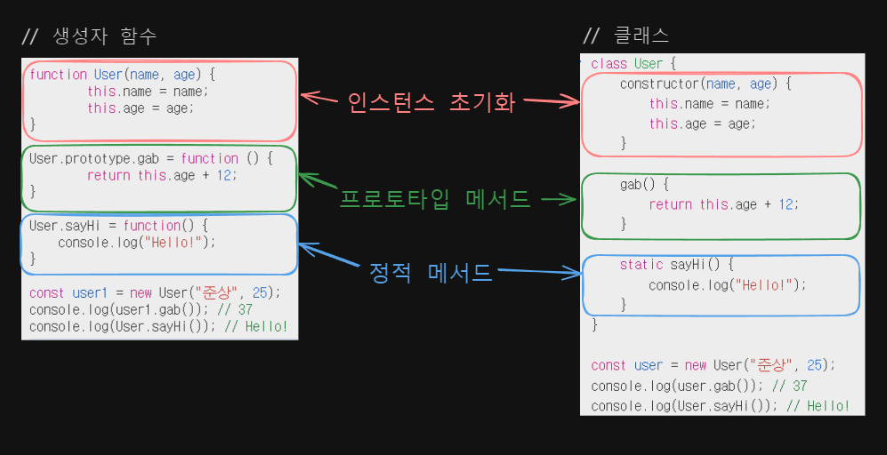
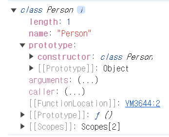

# [25장] 클래스

## 복습! 프로토타입

프로토타입은 **상속**을 위한 것.

```jsx
function User(name, age) {
  this.name = name;
  this.age = age;
}

// 프로토타입 메서드
User.prototype.gab = function () {
  return this.age + 12;
};

const user1 = new User("준상", 25); // User {name: "준상", age: 25 }
console.log(user1.gab()); // 37
```

user1 이라는 인스턴스(객체)에는 gab이라는 함수가 없지만,

프로토타입 체인에 의해 gab이라는 함수를 상속받을 수 있습니다.

## 복습2! 오버라이딩

<aside>
💡 오버라이딩(Overriding):
상위 메서드가 가진 메서드를 하위 메서드가 재정의하여 사용하는 것

</aside>

```jsx
function Person(name) {
  this.name = name;
}

Person.prototype.sayHi = function () {
  console.log(`Hi, ${this.name}`);
};

const me = new Person("Yoo");
me.sayHi = function () {
  console.log(`Hey!! My name is ${this.name}`);
};

// 인스턴스 메서드가 호출됨. 프로토타입 메서드는 인스턴스 메서드에 의해 가려짐.
// 메서드 오버라이딩!!
me.sayHi(); // Hey! My name is Yoo
```

## 클래스 vs 생성자 함수

<aside>
💡 클래스, 언제 사용하나요? - 전지전능한 chatGPT에게 물어봤습니다.

- **~~생성자 함수같은 틀딱 문법 안 쓰고 트렌디한 개발자가 되고 싶을 때~~**
  - **평가**: 이 항목은 JavaScript의 최신 문법을 사용하고자 하는 동기를 잘 설명하고 있습니다. 클래스 문법은 ES6에서 도입되었고, 더 현대적인 자바스크립트 스타일을 반영하므로 '트렌디한 개발자'가 되고 싶은 경우 클래스 사용을 권장하는 이유가 맞습니다. 다만, "틀딱 문법"이라는 표현은 다소 비하적인 느낌을 줄 수 있으므로, 보다 중립적인 언어를 사용하는 것이 좋겠습니다.
- **Java의 class 문법에 익숙한 개발자가 JS 배울 때**
  - **평가**: 이 항목은 JavaScript를 배우려는 Java 개발자들에게 특히 유용한 이유를 설명하고 있습니다. 클래스 문법은 Java와 유사하여 Java 개발자가 JavaScript를 배우는 데 도움이 될 수 있습니다. 이 설명은 명확하고 적절합니다.
- **직관적인 객체 생성 패턴을 사용하고자 할 때 (feat. extends, super)** - **평가**: 이 항목은 클래스 문법이 객체 지향 프로그래밍 패턴을 직관적으로 표현할 수 있음을 강조하고 있습니다. `extends`와 `super` 키워드를 통해 상속과 관련된 기능을 쉽게 구현할 수 있다는 점도 잘 지적하고 있습니다. 이는 클래스 문법의 주요 장점 중 하나입니다.
</aside>

|                                  | 클래스                                | 생성자 함수              |
| -------------------------------- | ------------------------------------- | ------------------------ |
| new                              | 반드시 new 붙여야 함                  | new 붙이면 생성자 함수,  |
| 안 붙이면 일반 함수              |
| 상속                             | extends, super 키워드 사용            | extends, super 사용 불가 |
| 호이스팅                         | 호이스팅 발생, but                    |
| let, const 호이스팅과 유사함.    | 함수 선언문 ⇒ 함수 호이스팅 발생      |
| 함수 표현식 ⇒ 변수 호이스팅 발생 |
| strict mode                      | 암묵적 strict mode이며, 해제 불가     | strict mode X            |
| 프로퍼티 열거                    | 모든 메서드의 프로퍼티 속성 열거 불가 | 열거 가능                |

<aside>
💡 (참고만… 몰라도 됩니당)
클래스의 모든 메서드의 프로퍼티 속성 열거가 불가능하다는  무슨 말인가요?

</aside>

```jsx
function MyConstructor(name) {
  this.name = name;
}

// 프로토타입 메서드
MyConstructor.prototype.twoMethod = function () {
  console.log("Hi!");
};

const obj = new MyConstructor("Elice");

console.log(obj); // MyConstructor {name: 'Elice'}

console.log(Object.keys(obj)); // ['name']

for (let key in obj) {
  console.log(key); // 'name', 'twoMethod' => 메서드 열거가 가능
}
```

```jsx
class MyClass {
  constructor(name) {
    this.name = name;
  }

  printMethod() {
    console.log(this.name);
  }

  static anotherMethod() {
    console.log("Hi!!");
  }
}

const obj = new MyClass("Elice");
console.log(obj); // MyClass {name: 'Elice'}
console.log(Object.keys(obj)); // ['name']
console.log(obj.hasOwnProperty("printMethod")); // false

for (let key in obj) {
  console.log(key); // 'name' 만 출력돼요..! => 메서드 열거가 불가능
}
```

**생성자 함수 방식과 클래스 방식을 비교해봅시다. (중요!!)**



## 클래스 호이스팅

```jsx
const Person = '';
{
	// 호이스팅이 발생하지 않는다면 ''이 출력되어야 함.
	console.log(Person);
	// ReferenceError: Cannot Access 'Person' before initialization

	class Person() {}
}
```

## 메서드

클래스 몸체에는 메서드만 선언할 수 있습니다.

⇒ constructor(생성자) / 프로토타입 메서드 / 정적 메서드

```jsx
class Person {
  constructor(name) {
    this.name = name;
  }
}
```



class가 생성한 객체에는 constructor 메서드가 없는 것을 볼 수 있습니다.

constructor 메서드는 **인스턴스 초기화 및 생성용인 특수한 메서드입니다.**

constructor는 생략할 수 있으며, 2개 이상일 경우 문법 오류가 발생합니다.

```jsx
// 생략하는 경우 암묵적으로 아래와 같이 생성
constructor() {}
```

생성자 함수와 마찬가지로 constructor 메서드 내부에서
return 문을 반드시 생략해야 합니다.

만약, 원시값을 return 하는 경우 무시되며

객체를 return하는 경우, this를 return하는 대신 객체를 return 합니다.

<aside>
💡 정적 메서드 vs 프로토타입 메서드
1. 프로토타입 체인이 서로 다릅니다.
2. 정적 메서드는 클래스로 호출하고, 프로토타입 메서드는 인스턴스로 호출합니다.
3. 정적 메서드는 인스턴스 프로퍼티를 참조할 수 없고, 프로토타입 메서드는 인스턴스 프로퍼티를 참조할 수 있습니다.

</aside>

<aside>
💡 클래스에서 정의한 메서드의 특징
1. ES6 메서드 축약 표현을 사용
2. 객체 리터럴과 달리 클래스 메서드를 정의할 때 콤마를 붙이지 않습니다.
3. strict mode 적용
4. 프로퍼티 열거가 불가능
5. non-constructor

</aside>

## 프로퍼티

### 인스턴스 프로퍼티

인스턴스 프로퍼티는 constructor 내부에서 정의해야 합니다.

```jsx
class Person {
  constructor(name) {
    this.name = name;
  }
}

const me = new Person("Yoo");
console.log(me); // Person {name: 'Yoo'}
```

### 접근자 프로퍼티

```jsx
class Person {
  constructor(firstName, lastName) {
    this.firstName = firstName;
    this.lastName = lastName;
  }

  get fullName() {
    return `${this.firstName} ${this.lastName}`;
  }

  set fullName(name) {
    [this.firstName, this.lastName] = name.split(" ");
  }
}

const me = new Person("meow", "Tiger");
// setter 함수
me.fullName = "Zunsang Yoo";
console.log(me); // {firstName: "Zunsang", lastName: "Yoo"}

// getter 함수
console.log(me.fullName); // Zunsang Yoo
```

### 클래스 필드 정의

2022년 6월 기준 정식 표준으로 승급 ⇒ 맘껏 쓰세요.

```jsx
class Person {
  // 클래스 필드 정의
  name = "Lee";

  // 클래스 필드에 함수 할당
  getName = function () {
    return this.name;
  };
  // 화살표 함수로도 가능
  // getName = () => this.name;
}

const me = new Person();
console.log(me); // Person {name: "Lee", getName: f}
```

클래스 필드에 함수를 할당하면, 프로토타입 메서드가 아닌 인스턴스 메서드가 됩니다.

따라서, 클래스 필드에 함수를 할당하는 것은 권장하지 않습니다.

결론 :

인스턴스를 생성할 때 외부 초기값으로 클래스 필드를 초기화 ⇒ constructor 메서드로 정의

외부 초기값으로 클래스 필드 초기화 필요 X ⇒ constructor 메서드 방식, 클래스 필드 모두 사용 가능

### private 필드 정의

```jsx
class Person {
  // private 필드 정의
  #name = "";

  constructor(name) {
    this.#name = name;
  }
}

const me = new Person("Yoo");
console.log(me.#name); // SyntaxError: Private field '#name' must be declared in an enclosing class
```

private 필드는 식별자 앞에 #을 붙이며,

class 내부에서만 참조가 가능합니다.

### static 필드 정의

```jsx
class MyMath {
  static PI = 22 / 7;

  static #num = 10;

  static increment() {
    return ++MyMath.#num;
  }
}

console.log(MyMath.PI); // 3.142857142857143
console.log(MyMath.increment()); // 11
```

static 필드는 식별자 앞에 static을 붙이면 됩니다.

## 상속에 의한 클래스 확장

클래스는 상속을 통해 다른 클래스를 확장할 수 있습니다.

extends 키워드를 이용해 간편하고 직관적인 확장이 가능합니다.

### extends 키워드

```jsx
// 슈퍼 클래스
class Base {}

// 서브 클래스
class Derived extends Base {}
```

### 동적 상속

```jsx
function Base1() {}

class Base2 {}

let condition = true;
// 조건에 따라 동적으로 상속 대상을 결정할 수 있음.
class Derived extends (condition ? Base1 : Base2) {}
```

### 서브 클래스의 constructor

서브 클래스에서 constructor 메서드를 생략하면 아래와 같이 암묵적으로 정의됩니다.

```jsx
constructor(...args) { super(...args); }
```

### super 키워드

super 호출 ⇒ 슈퍼클래스의 constructor를 호출

```jsx
class Base {
  constructor(a, b) {
    this.a = a;
    this.b = b;
  }
}

class Derived extends Base {
  // constructor(...args) { super(...args); }
}

const me = new Derived(1, 2);
console.log(me); // Derived {a: 1, b: 2}
```

<aside>
💡 super 호출 시 주의사항
1. 서브클래스에서 constructor를 생략하지 않는 경우, 반드시 super 먼저 호출
2. super 호출 전에는 this를 참조할 수 없습니다.
3. super는 서브클래스에서만 호출할 수 있습니다.

</aside>

super 참조 ⇒ 슈퍼클래스의 메서드 호출

```jsx
class Base {
  constructor(name) {
    this.name = name;
  }

  sayHi() {
    return `Hi, ${this.name}`;
  }
}

class Derived extends Base {
  sayHi() {
    // super.sayHi는 슈퍼클래스의 정적 메서드를 가리킴.
    return `${super.sayHi()}. Nice to meet you`;
  }
}

const derived = new Derived("Yoo");
console.log(derived.sayHi()); // Hi, Yoo. Nice to meet you
```
