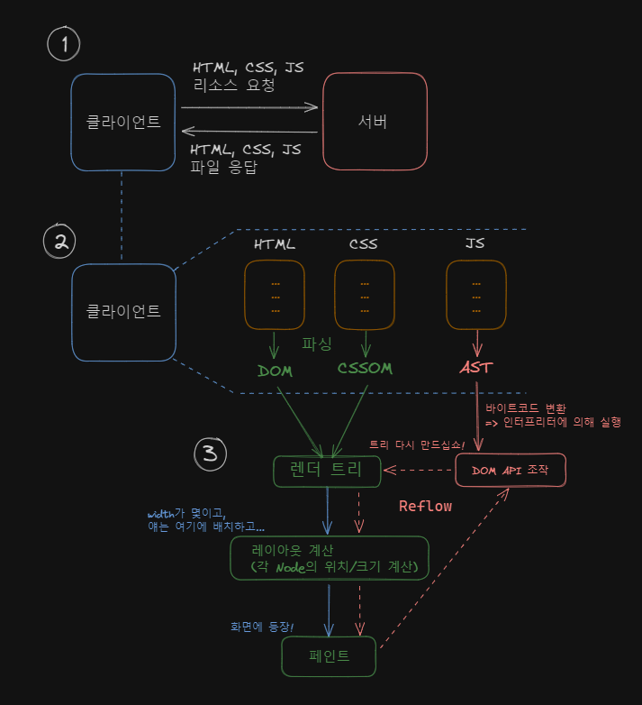

# [38장] 브라우저의 렌더링 과정

## 렌더링 과정 요약



## 요청과 응답


브라우저 상단에 URL을 입력할 수 있는 입력칸이 있는데,
이를 사용자 인터페이스(User Interface)라고 합니다.

DNS(Domain Name System) 라는 녀석이 있는데,
도메인 이름을 서버가 알기 쉬운 IP 주소로 변환해 줍니다.
사용자가 [swtrack.elice.io/my](http://swtrack.elice.io/my) 라고 입력하면, DNS가 해당하는 IP 주소로 변경해 줍니다.

## HTTP 1.1 vs HTTP 2.0

|          | HTTP 1.1                          | HTTP 2.0                                       |
| -------- | --------------------------------- | ---------------------------------------------- |
| 차이점 1 | 단일 요청 / 응답                  | 다중 요청 응답                                 |
| 차이점 2 | 리소스가 많아지면 응답시간 길어짐 | 여러 리소스를 동시에 처리하므로 처리 속도 증가 |

## HTML 파싱과 DOM 생성


## CSS 파싱과 CSSOM 생성

`<link href="/css" rel="stylesheet" />` 태그 or `<style>…</style>` 태그를 만나면,

CSS 파싱을 시작합니다.

<aside>
💡 (심화) CSS 로드는 반드시 DOM 생성 중단??

link 태그로 외부 CSS 파일을 로드해 오는 경우 ⇒ HTML 파싱 중단됨
style 태그로 인라인 스타일 적용의 경우 ⇒ HTML 파싱 계속 진행됨

</aside>

CSS 파싱도 HTML 파싱과 비슷한 과정을 거칩니다.


byte stream ⇒ 문자열 ⇒ tokenization ⇒ 객체 ⇒ Node ⇒ CSSOM

CSSOM이 모두 생성되면, 중단된 부분부터 다시 DOM을 생성하러 갑니다.

## 렌더 트리 생성

DOM과 CSSOM 둘 다 완성이 되면, 렌더 트리를 만듭니다.


렌더 트리에서 보이지 않는 요소는 제외합니다.

(예를 들어, `meta, script 태그 or display:none;` 속성 등)

Javascript에 의해 DOM에 변경 사항이 생기는 경우 렌더 트리의 노드를 재결합하는 Reflow가 발생합니다.

<aside>
💡 Reflow가 발생하는 경우

1. 자바스크립트로 인한 노드 추가/삭제/변경

2. viewport 변경 (예를 들어, 노트북 화면에서 모바일 화면으로 변경)

3. 레이아웃 변경 (예를 들어, width를 3px에서 5px 로 변경해라)

</aside>

## 자바스크립트 파싱과 실행

DOM이 생성되면 DOM API라는 것을 HTML이 제공하는데,
자바스크립트는 DOM API를 이용해 동적으로 DOM 요소를 조작할 수 있습니다.

`<script src=”script.js” />` 태그를 만나면

DOM 생성을 중단하고 렌더링 엔진에서 자바스크립트 엔진에게 제어권을 넘깁니다. (async /defer 를 사용하는 경우 제외)

자바스크립트 실행이 완료되면 다시 렌더링 엔진에게 제어권을 넘겨
DOM 생성 중단 부분부터 DOM을 다시 생성해 나갑니다.

<aside>
💡 렌더링 엔진 vs 자바스크립트 엔진

렌더링 엔진은 HTML, CSS를 파싱하고 DOM, CSSOM을 만들고,
자바스크립트 엔진은 자바스크립트를 파싱하고 AST(추상 구문 트리)를 만듭니다.

</aside>

## Reflow & Repaint

Reflow 는 DOM 구조의 변경이 일어날 때, 렌더 트리의 노드를 재결합 ⇒ 레이아웃을 계산 ⇒ 페인트하는 과정입니다.

Repaint는 스타일은 변경되나 레이아웃 자체는 변경되지 않는 경우 Reflow 과정 없이 paint만 다시 하는 과정입니다.

## 자바스크립트 파싱에 의한 HTML 파싱 중단

```jsx
<!DOCTYPE html>
<html lang="ko">
	<head>
	    <meta charset="UTF-8">
	    <meta name="viewport" content="width=device-width, initial-scale=1.0">
	    <title>만들기 귀찮아</title>
	    <link rel="stylesheet" href="style.css" />
	    <script src="main.js"></script>
	</head>
	<body>
	    <h1>본문입니다.</h1>
	</body>
</html>
```

script 태그의 위치는 중요합니다.

위의 코드에서 h1의 innerText를 본문이지롱~ 으로 변경하는 코드가 main.js 에 있다고 할 때

정상적으로 작동하지 않습니다.

그 이유는 DOM에서 h1 태그를 파싱하지 않은 채 자바스크립트로 제어권이 넘어간 상태이기 때문입니다.

따라서, **외부 자바스크립트를 불러오는 script 태그는 body 태그 내부 가장 바닥에 위치하는 것이 일반적**입니다.

이렇게 했을 때의 이점으로는

1. DOM을 조작하는 자바스크립트 코드가 정상적 작동
2. 페이지 로딩 시간 단축

<aside>
💡 (심화) script 태그는 body 태그 바닥에 두어야 한다는 건 이해했는데, CSS를 로드해오는 link 태그나 style 태그는 왜 head 태그에 두는 것인가요??

- 설명 보기
  **CSSOM 생성을 가능한 빨리 진행시킨다면, HTML 파싱 과정과 함께 스타일을 동시에 적용할 수 있습니다.
  CSSOM 생성이 빠를 수록, 렌더 트리 생성 속도가 빨라지고,
  최종 렌더링 속도도 빨라집니다.
  반면, JS 로드 시점이 빨라진다면, 그 동안 DOM 생성이 중단되어 렌더 트리 생성이 느려지고 결국 이는 최종 렌더링 속도에 영향을 미칩니다.**

</aside>

## script 태그의 async / defer 속성

인라인으로 자바스크립트를 작성하지 않고 외부 자바스크립트 파일을 로드해오는

아까와 같은 코드 예시에서만 async / defer 어트리뷰트를 사용할 수 있습니다.

async와 defer 모두 외부 JS 로드가 HTML 파싱과 비동기적으로 진행된다는 공통점이 있습니다.

차이점으로는,

async는 파싱을 마친 JS를 실행 시 HTML 파싱이 중단됩니다.

순서 보장이 중요한 코드가 있는 경우, async 어트리뷰트를 지양해야 합니다.

defer는 JS 실행 종료 시점이 DOM 생성 완료 직후의 시점과 일치하게 진행됩니다.

DOM 생성이 완료된 이후 실행되어야 할 자바스크립트 코드에 유용합니다.
