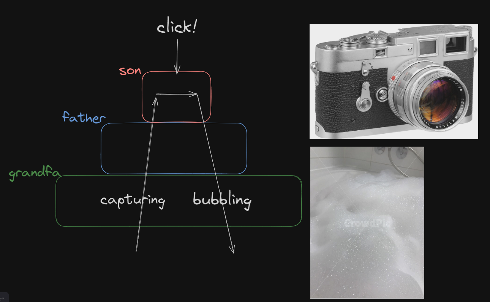

# [40.1-40.4] 이벤트

## 이벤트 드리븐 프로그래밍

이벤트 드리븐 프로그래밍이란,

프로그램의 흐름을 *이벤트 중심*으로 제어하는 프로그래밍 방식.

이벤트가 발생했을 때 특정 동작을 수행하게 하려면,

이벤트가 발생할 때 함수가 동작하게 해야 하는데 **코드는 함수를 언제 호출할 지 알 수 없습니다.**

따라서,

**개발자가 명시적으로 함수 호출 X / 브라우저에게 함수 호출 위임(이벤트 핸들러 등록)**

아래는 버튼이 클릭되었을 때 alert 창으로 ‘클릭이 감지’ 라는 alert를 띄우는 코드입니다.

```jsx
<!DOCTYPE html>
<html>
<body>
  <button>눌러</button>
  <script>
    const $button = document.querySelector("button");

    $button.onclick = () => { alert("클릭이 감지!") };
  </script>
</body>
</html>
```

## 이벤트 타입

이벤트 타입 : *이벤트의 종류*를 나타내는 문자열

예를 들어, ‘click’ 은 마우스 버튼을 클릭했을 때 발생하는 이벤트

사용 빈도가 높은 이벤트 타입은 아래와 같습니다!

**마우스 이벤트:**

- `click` – 요소 위에서 마우스 왼쪽 버튼을 눌렀을 때(터치스크린이 있는 장치에선 탭 했을 때) 발생합니다.
- `contextmenu` – 요소 위에서 마우스 오른쪽 버튼을 눌렀을 때 발생합니다.
- `mouseover`와 `mouseout` – 마우스 커서를 요소 위로 움직였을 때, 커서가 요소 밖으로 움직였을 때 발생합니다.
- `mousedown`과 `mouseup` – 요소 위에서 마우스 왼쪽 버튼을 누르고 있을 때, 마우스 버튼을 뗄 때 발생합니다.
- `mousemove` – 마우스를 움직일 때 발생합니다.

**폼 요소 이벤트:**

- `submit` – 사용자가 `<form>`을 제출할 때 발생합니다.
- `focus` – 사용자가 `<input>`과 같은 요소에 포커스 할 때 발생합니다.

**키보드 이벤트:**

- `keydown`과 `keyup` – 사용자가 키보드 버튼을 누르거나 뗄 때 발생합니다.

**문서 이벤트:**

- `DOMContentLoaded` – HTML이 전부 로드 및 처리되어 DOM 생성이 완료되었을 때 발생합니다.

**CSS 이벤트:**

- `transitionend` – CSS 애니메이션이 종료되었을 때 발생합니다.

## 이벤트 핸들러 등록 방식 3가지

### 1. 이벤트 핸들러 어트리뷰트 방식

어트리뷰트의 이름은 **on 접두사 + 이벤트 타입**을 사용합니다.

주의할 점으로는 다른 방식과는 달리 함수 참조가 아닌 **함수 호출문 등의 문**을 할당해야 합니다.

```jsx
// sayHi("Yoo") 는 함수 몸체로 들어가게 됩니다.
<button onclick="sayHi("Yoo")"></button>

// sayHi("Yoo")가 파싱되어 아래와 같이 됩니다.
function onclick(event) {
	sayHi("Yoo");
}
```

이처럼 동작하는 이유는 이벤트 핸들러에 인수를 전달하기 위함입니다.

```jsx
// "Yoo" 라는 인수를 전달하기 곤란
<button onclick="sayHi"></button>
```

HTML과 JS는 관심사가 다르므로 분리하는 것이 좋기 때문에

이벤트 핸들러 어트리뷰트 방식을 사용하는 것을 지양합니다.

<aside>
💡 CBD - React 의 경우 이벤트 핸들러 어트리뷰트 방식을 사용합니다.

```jsx
<button onClick={handleClick}>저장</button>
```

</aside>

### 2. 이벤트 핸들러 프로퍼티 방식

마찬가지로 프로퍼티값은 **on 접두사 + 이벤트 타입명**

```jsx
// $button <= 이벤트 타깃
// onclick <= 이벤트 타입
// 프로퍼티에 할당하는 함수 <= 이벤트 핸들러
$button.onclick = function () {
  console.log("클릭 감지");
};
```

이벤트 핸들러 프로퍼티 방식은 HTML과 JS가 혼재되지 않는 장점이 있지만

이벤트 핸들러 프로퍼티에 하나의 이벤트 핸들러만 바인딩할 수 있는 단점이 있습니다.

### 3. addEventListener 메서드 방식

**EventTarget.prototype.addEventListener 메서드**를 사용하는 방식입니다.

```jsx
// 첫번째 매개변수 <= 이벤트 타입
// 두번째 매개변수 <= 이벤트 핸들러
// 마지막 매개변수(옵션) <= 캡쳐 사용 여부
// 생략 or false : bubbling, true : capturing
EventTarget.addEventListener('eventType', function, [,useCapture])
```

addEventListener 메서드 방식은 여러 개의 이벤트 핸들러 함수를 등록할 수 있는 장점이 있습니다.

이벤트 핸들러 참조가 동일한 것이 있다면 하나만 실행됩니다.

<aside>
💡 capturing과 bubbling이 뭐죠? - event flow 방식의 차이입니다.

```jsx
<!DOCTYPE html>
<html>
  <body>
    <div class="grandfa">
      <button class="father">
        <p class="son">날 눌러</p>
      </button>
    </div>
    <script>
      const $grandfa = document.querySelector(".grandfa");
      const $father = document.querySelector(".father");
      const $son = document.querySelector(".son");

      // 이 때 $son을 누르면 console에 어떻게 찍힐까요??
      $grandfa.addEventListener("click", () => console.log("할아버지"));
      $father.addEventListener("click", () => console.log("아빠"), true);
      $son.addEventListener("click", () => console.log("아들"));
    </script>
  </body>
</html>
```



## 이벤트 핸들러 제거

**EventTarget.prototype.removeEventListener 메서드**를 사용하여

이벤트 핸들러를 제거할 수 있습니다.

단, addEventListener 메서드에 전달한 인수와 removeEventListener 메서드에 전달한 인수가 **동일**해야 제거가 됩니다.

```jsx
<!DOCTYPE html>
<html>
<body>
  <button>눌러</button>
  <script>
    const $button = document.querySelector("button");

    const handleClick = () => { console.log("클릭 감지!") };

    $button.addEventListener("click", handleClick);

    // 이벤트 핸들러 제거
    // 인수가 일치하지 않으면 제거되지 않음
    $button.removeEventListener("click", handleClick, true); // ❌
    $button.removeEventListener("click", handleClick); // ✅
  </script>
</body>
</html>
```

무명 함수를 이벤트 핸들러로 등록한 경우, 이벤트 핸들러를 제거할 수 없습니다.

```jsx
$button.addEventListener("click", () => {
  console.log("난 제거 못해");
});
```

기명 함수를 이벤트 핸들러로 등록한다면, 이벤트 핸들러를 제거할 수 있습니다.

아래와 같이 작성하면 단 한번만 작동하는 이벤트 핸들러를 만들 수 있습니다.

```jsx
$button.addEventListener("click", function foo() {
  console.log("제거 가능");

  $button.removeEventListener("click", foo);
});
```

기명 함수를 이벤트 핸들러로 등록할 수 없다면 arguments.callee를 사용할 수도 있습니다.

```jsx
$button.addEventListener("click", function () {
  console.log("제거 가능");

  $button.removeEventListener("click", arguments.callee);
});
```

단, arguments.callee는 코드 최적화를 방해하므로 strict mode에서의 사용이 금지됩니다.

이벤트 핸들러 프로퍼티 방식으로 등록한 이벤트 핸들러는 removeEventListener를 사용할 수 없습니다.

대신 이벤트 핸들러 프로퍼티에 null을 할당해 이벤트를 삭제할 수 있습니다.

```jsx
<!DOCTYPE html>
<html>
<body>
  <button>눌러</button>
  <script>
    const $button = document.querySelector("button");

    const handleClick = () => { console.log("클릭 감지!") };

    $button.onclick = handleClick;

    // 이벤트 핸들러 제거
    // 프로퍼티에 null을 할당하는 방식으로!
    $button.removeEventListener("click", handleClick); // ❌
    $button.onclick = null; // ✅

  </script>
</body>
</html>
```
