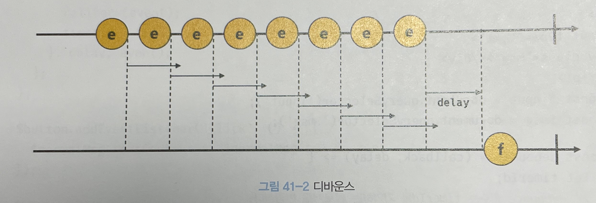

# [41장] 타이머

## 호출 스케줄링이란?

함수를 즉시 실행하고 싶다 ⇒ 그냥 호출하면 됨

일정 시간이 지나고 실행시키고 싶다 ⇒ **타이머 함수 이용**

이렇게 일정 시간 후에 함수 호출을 예약하는 것을 **호출 스케줄링** 이라고 합니다.

## 타이머 함수

|             | 딱 한 번 실행 | 반복 실행     |
| ----------- | ------------- | ------------- |
| 타이머 셋팅 | setTimeout    | setInterval   |
| 타이머 삭제 | clearTimeout  | clearInterval |

setTimeout은 인수를 두 개 받습니다.

- 첫번째 인수 ⇒ 콜백 함수
- 두번째 인수 ⇒ 지연 시간

```jsx
// 1초 뒤에 인사~
let timer = setTimeout(() => console.log('Hi')), 1000);
// 타이머를 해제하려면
clearTimeout(timer);

// 콜백 함수로 인자를 넘기고 싶으면?
setTimeout((name) => console.log(`Hi, ${name}.`), 1000, 'Yoo');

// (질문!) 아래의 출력 결과는 어떻게 될까요?
console.log(1);
setTimeout(() => console.log(2));
console.log(3);
```

setInterval도 setTimeout이랑 똑같기 때문에 생략하겠습니다.

## 디바운스와 스로틀

디바운스와 스로틀이 필요한 경우 : **과도한 이벤트 핸들러 호출 방지**




### 디바운스 코드 예시

```jsx
const $input = document.querySelector("input");
const $msg = document.querySelector(".msg");

const debounce = (callback, delay) => {
  let timerId;
  // debounce 함수는 timerId를 기억하는 클로저를 반환한다.
  return (...args) => {
    // delay가 경과하기 이전에 이벤트가 발생하면 이전 타이머를 취소하고
    // 새로운 타이머를 재설정한다.
    // 따라서 delay보다 짧은 간격으로 이벤트가 발생하면 callback은 호출되지 않는다.
    if (timerId) clearTimeout(timerId);
    timerId = setTimeout(callback, delay, ...args);
  };
};

// debounce 함수가 반환하는 클로저가 이벤트 핸들러로 등록된다.
// 300ms보다 짧은 간격으로 input 이벤트가 발생하면 debounce 함수의 콜백 함수는
// 호출되지 않다가 300ms 동안 input 이벤트가 더 이상 발생하면 한 번만 호출된다.
$input.oninput = debounce((e) => {
  $msg.textContent = e.target.value;
}, 300);
```

### 스로틀 코드 예시

```jsx
const $container = document.querySelector(".container");
const $normalCount = document.querySelector(".normal-count");
const $throttleCount = document.querySelector(".throttle-count");

const throttle = (callback, delay) => {
  let timerId;
  // throttle 함수는 timerId를 기억하는 클로저를 반환한다.
  return (...args) => {
    // delay가 경과하기 이전에 이벤트가 발생하면 아무것도 하지 않다가
    // delay가 경과했을 때 이벤트가 발생하면 새로운 타이머를 재설정한다.
    // 따라서 delay 간격으로 callback이 호출된다.
    if (timerId) return;
    timerId = setTimeout(() => {
      callback(...args);
      timerId = null;
    }, delay);
  };
};

let normalCount = 0;
$container.addEventListener("scroll", () => {
  $normalCount.textContent = ++normalCount;
});

let throttleCount = 0;
// throttle 함수가 반환하는 클로저가 이벤트 핸들러로 등록된다.
$container.addEventListener(
  "scroll",
  throttle(() => {
    $throttleCount.textContent = ++throttleCount;
  }, 100)
);
```
